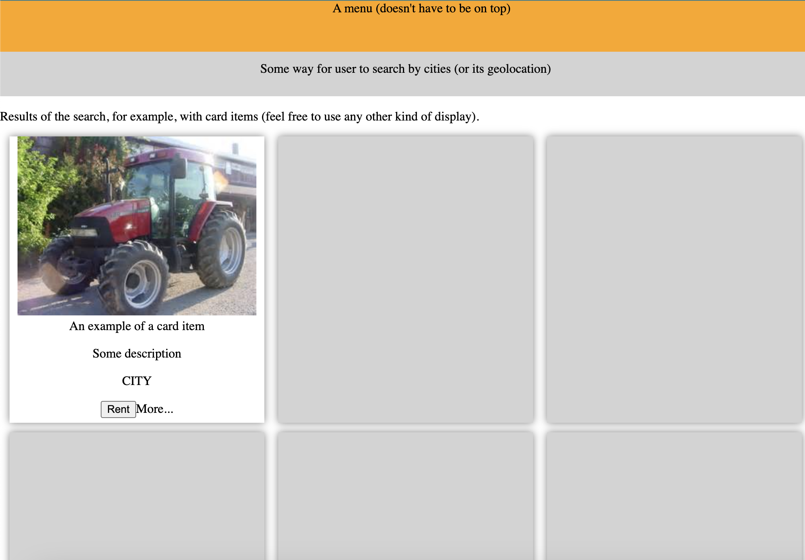

# HTML and CSS basic template for Sotracteur

This template is for students of EPITA SIGL 2025.

It contains html and css file with responsive code.

It uses [Font Awesome (Free)](https://github.com/FortAwesome/Font-Awesome) to benefit some nice free icons.

## Start as standalone

Type the following commands to run this template on http://localhost:8080:

```sh
# from root of this repository,
# make sure you have node v21 installed or activated via nvm use
node -v
> 21.X.X
# Starts a webserver on localhost.
npx http-server . -p 8080
> ...
```

> Note: install [nvm going thru the README](https://github.com/nvm-sh/nvm) tool on your machine to switch between/install different versions
> of NodeJS.

You should see the template on your browser:

